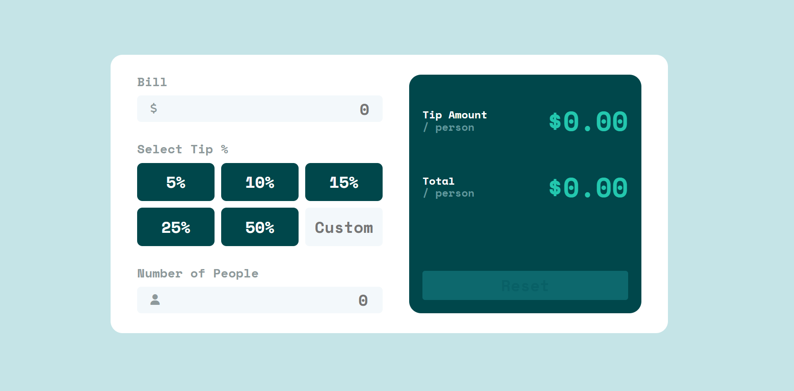
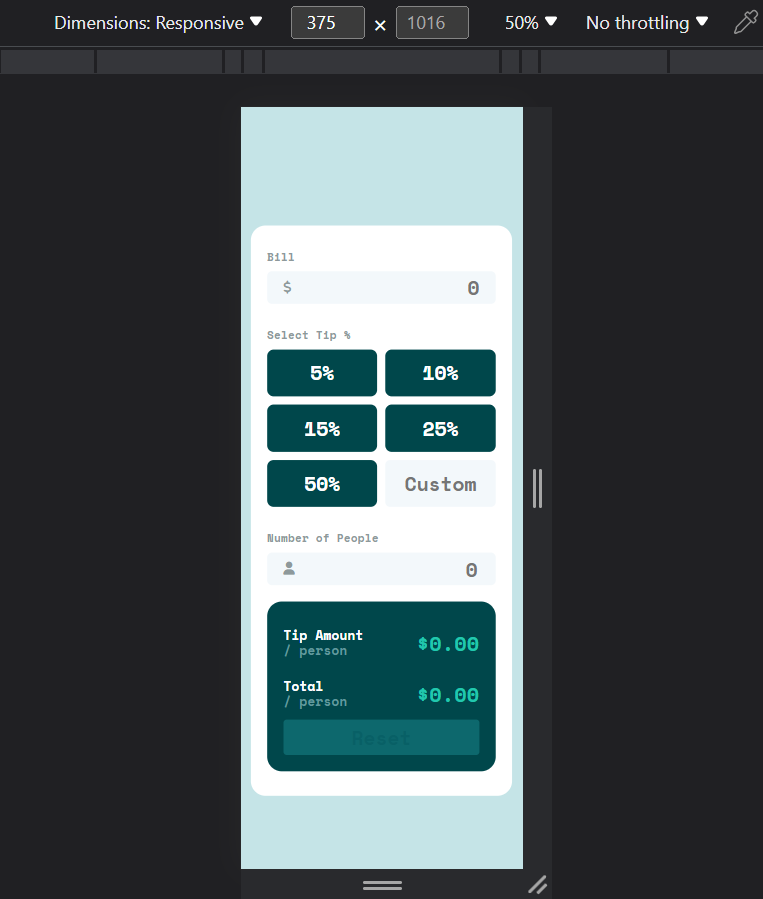

# Frontend Mentor - Tip calculator app solution

This is a solution to the [Tip calculator app challenge on Frontend Mentor](https://www.frontendmentor.io/challenges/tip-calculator-app-ugJNGbJUX). Frontend Mentor challenges help you improve your coding skills by building realistic projects.

## Table of contents

- [Overview](#overview)
  - [The challenge](#the-challenge)
  - [Screenshot](#screenshot)
  - [Links live site](#links-live-site)
- [My process](#my-process)
  - [Built with](#built-with)
- [Author](#author)
- [Acknowledgments](#acknowledgments)

## Overview

### The challenge

Users should be able to:

- View the optimal layout for the app depending on their device's screen size
- See hover states for all interactive elements on the page
- Calculate the correct tip and total cost of the bill per person

### Screenshot

### Links Live Site

- Live Site URL: [Add live site URL here](https://ali-el-shoraa.github.io/tip-calculator-app-main/)

## My process

### Built with

- Semantic HTML5 markup
- CSS
  - Flexbox
  - CSS Grid
  - Media Queries
  - Normalize - CSS library
- JavaScript
- DOM
- [Fontawesome](https://fontawesome.com/) - icon library
- [Fonts Google](https://fonts.google.com/) - font library

## Author

- Github - [Ali-El-Shoraa](https://github.com/Ali-El-Shoraa)
- Frontend Mentor - [@Ali-El-Shoraa](https://www.frontendmentor.io/profile/Ali-El-Shoraa)
- Codepen - [@Ali_El-Shoraa](https://codepen.io/Ali_El-Shoraa)

## Acknowledgments

Many thanks to anyone who provided feedback
